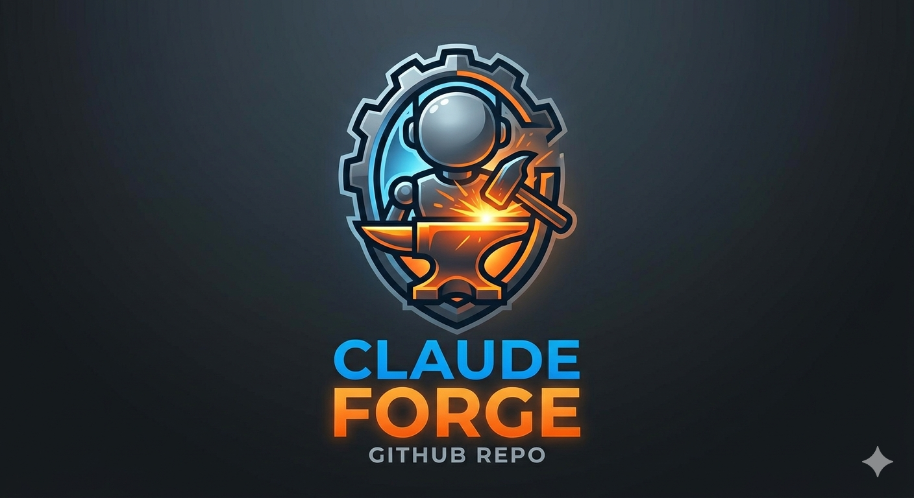
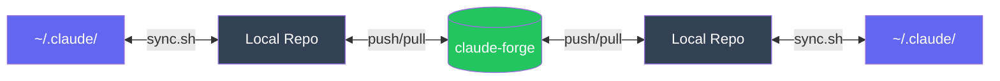
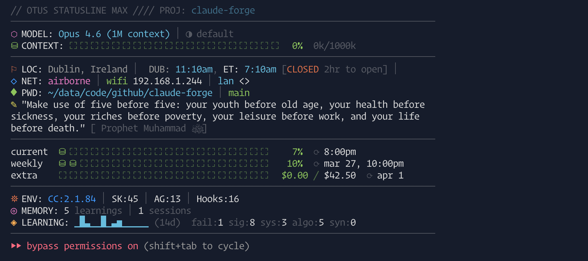
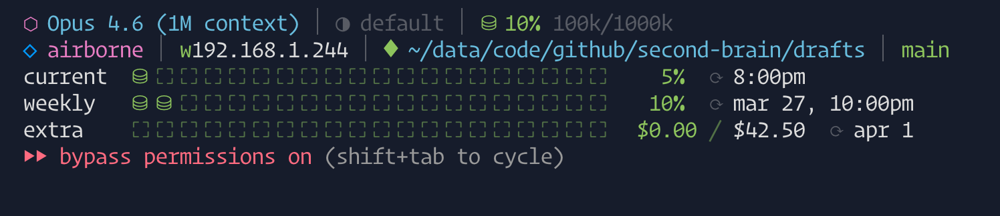

<p align="center">
  
</p>

<h1 align="center">claude-forge</h1>

<p align="center">
  <strong>A battle-tested harness for Claude Code — skills, agents, hooks, and workflows forged from daily use across 7+ production projects.</strong>
</p>

<p align="center">
  <a href="#quick-start">Quick Start</a> &bull;
  <a href="#whats-inside">What's Inside</a> &bull;
  <a href="#context-engineering">Context Engineering</a> &bull;
  <a href="#skills">Skills</a> &bull;
  <a href="#agents">Agents</a> &bull;
  <a href="#hooks">Hooks</a> &bull;
  <a href="#scripts--tools">Scripts & Tools</a> &bull;
  <a href="#statusline">Statusline</a> &bull;
  <a href="#customization">Customization</a>
</p>

<p align="center">
  
  
  
  
  
  
  
</p>

---

## The Problem

Claude Code is powerful out of the box, but after a few weeks of real project work you notice:

- **Context waste** — Claude re-scans the codebase every session because it doesn't know where things are
- **Sycophancy** — it agrees with you instead of pushing back on bad ideas
- **No session continuity** — close the terminal, lose the thread
- **Manual repetition** — the same git, test, review workflows over and over
- **No guardrails** — nothing stops it from committing `.env` files or running destructive commands

**claude-forge** fixes all of this with 49 skills, 12 agents, and 22 hooks that work together as a coherent system.

### Multi-Machine, Multi-User

claude-forge is designed as a **portable, git-synced config** that works across machines and users:

- Clone on any machine → run setup → identical Claude Code environment in seconds
- Edit skills/hooks on Machine A → `git push` → `git pull` + sync on Machine B
- Team members fork, customize, and contribute back
- Bidirectional sync means you can edit in `~/.claude/` or in the repo — the sync script picks up whichever is newer



---

## Quick Start

### Option 1: Point Claude Code to this repo

Add to your `~/.claude/settings.json`:

```json
{
  "projects": {
    "github.com/youruser/claude-forge": {}
  }
}
```

Or simply tell Claude Code: *"Use https://github.com/youruser/claude-forge as my config repo"*

### Option 2: Manual setup

```bash
# Clone
git clone https://github.com/youruser/claude-forge.git
cd claude-forge

# Run setup (idempotent — safe to re-run)
./claude-config-setup.sh
```

The setup script symlinks skills, agents, hooks, and config to `~/.claude/`. It won't overwrite existing files — it warns and skips.

---

## What's Inside

```
claude-forge/
├── CLAUDE.md                       # Global rules (anti-sycophancy, context engineering)
├── settings.json                   # Hook wiring, permissions, plugins
├── RTK.md                          # Token compression proxy docs
├── claude-config-setup.sh          # First-time setup (idempotent)
├── claude-config-sync.sh           # Bidirectional sync: repo ↔ ~/.claude/
├── sync-all.sh                     # Update all repos + config sync
│
├── skills/                         # 49 custom slash commands
│   ├── my-prompt/                  #   Transform rough ideas into disciplined prompts
│   ├── my-loop/                    #   Multi-task execution with checkpoints
│   ├── my-create-acceptance-criteria/  #   Generate measurable acceptance criteria
│   ├── my-init-session/            #   Session setup with features.json tracking
│   ├── my-save/                    #   Session summary + state.md auto-update
│   ├── my-save-&-git-sync/         #   Save + commit + push in one command
│   ├── my-git-sync/                #   Git stage, commit, push workflow
│   ├── my-pr-review/               #   6-agent parallel PR review
│   ├── my-adversarial-review/      #   Skeptic/believer/referee iterative review
│   ├── my-code-gaps-fix/           #   Audit code against acceptance criteria
│   ├── my-generate-tests/          #   Auto-generate test suites
│   ├── my-smoke-test/              #   Playwright e2e smoke tests
│   ├── my-qa/                      #   Browser-based QA testing
│   ├── my-security-scan/           #   SAST, dependency audit, secret detection
│   ├── my-office-hours/            #   Adversarial problem reframing
│   ├── my-agent-teams/             #   Multi-agent parallel task execution
│   ├── my-runbook/                 #   Structured incident investigation
│   ├── my-incident-response/       #   Production incident triage + postmortem
│   ├── my-llm-dev/                 #   Patterns for RAG, embeddings, agents
│   ├── my-c4-architecture/         #   C4 diagrams as Mermaid
│   ├── my-review-docs/             #   Multi-personality doc review
│   ├── my-plugin-dev/              #   Scaffold skills, hooks, agents
│   ├── my-autoresearch/            #   Iterative self-improvement loop
│   ├── my-statusline/              #   Switch between mini/max/none
│   ├── my-careful/                 #   Block destructive commands on demand
│   ├── my-freeze/                  #   Restrict edits to a directory
│   ├── my-hookify/                 #   Manage hooks via natural language
│   ├── my-babysit-pr/              #   Watch CI, retry flaky tests, auto-merge
│   ├── my-catchup/                 #   Recent session overview
│   ├── my-get-me-up2speed/         #   Cross-session work summary
│   ├── my-prompt-history/          #   Show recent user prompts
│   ├── my-show-info/               #   Quick lookup for setup info
│   ├── my-fetch-tweet/             #   Twitter content fetcher
│   ├── my-fetch-article/           #   Web article extractor
│   ├── my-fetch-repo/              #   GitHub repo metadata fetcher
│   ├── my-research-targets/        #   Research URLs for improvements
│   ├── my-classify-content/        #   Classify content against projects
│   ├── my-write-research-entries/  #   Write research to knowledge base
│   ├── my-my-project-find-potential-improvements/
│   ├── my-project-to-brain-sync/   #   Export project state to my-project
│   ├── my-claude-config-sync/      #   Sync configs between machines
│   ├── my-sync-all/                #   Pull all repos + config sync
│   ├── my-update-boilerplate-webapp/  #   Sync components to template repo
│   ├── my-self-improve/            #   Analyze session history for automation opportunities
│   ├── my-sanitize/                #   Scan public repos for sensitive data before pushing
│   ├── my-classify-content/        #   Classify content against projects
│   ├── my-research-targets/        #   Research URLs for improvements
│   ├── my-write-research-entries/  #   Write research to knowledge base
│   ├── bug-hunt/                   #   Adversarial bug hunting
│   └── webapp-testing/             #   Playwright browser interaction toolkit
│
├── agents/                         # 12 reusable agent personalities
│   ├── debate/                     #   Adversarial trio (always used together)
│   │   ├── skeptic.md              #     Finds edge cases, race conditions, holes
│   │   ├── believer.md             #     Argues for the approach with evidence
│   │   └── referee.md              #     Final ruling: ship vs wait
│   ├── reviewers/                  #   Code, doc, security evaluation
│   │   ├── code.md                 #     10-dimension code review
│   │   ├── doc.md                  #     Documentation accuracy + completeness
│   │   └── security.md             #     OWASP A1-A10, STRIDE, SAST
│   ├── specialists/                #   Domain expertise
│   │   ├── architect.md            #     System design, data model, scale
│   │   ├── platform.md             #     DR, backup compliance, cron durability
│   │   └── frontend.md             #     Core Web Vitals, React patterns
│   ├── scouts/                     #   External research
│   │   ├── twitter.md              #     Twitter/X data fetcher
│   │   └── github.md               #     GitHub repo researcher
│   └── workers/                    #   Task execution
│       └── crawler.md              #     Web crawler via Cloudflare Browser Rendering
│
├── hooks/                          # 19 event-driven scripts
│   ├── session-start.sh            #   Load context on session init
│   ├── session-summary.sh          #   Auto-save on session end
│   ├── usage-limit-resume.sh       #   Auto-resume on rate limit
│   ├── cost-tracker.sh             #   Track spend per session
│   ├── timestamp.sh                #   Event timestamps
│   ├── pre-compact.sh              #   Save state before compaction
│   ├── post-edit-format.sh         #   Auto-format after edits
│   ├── rtk-rewrite.sh              #   Token-optimized CLI proxy
│   ├── pre-git-add-guard.sh        #   Prevent staging secrets
│   ├── security-validator.sh       #   Block dangerous patterns
│   ├── careful-mode-guard.sh       #   On-demand destructive cmd blocker
│   ├── freeze-guard.sh             #   Directory edit restriction
│   ├── sanitize-public-repo.sh     #   Block sensitive data in public repo pushes
│   ├── block-destructive.sh        #   Block rm -rf, force push, etc.
│   ├── block-pip-install.sh        #   Prevent global pip installs
│   ├── block-pkg-managers.sh       #   Guard package manager usage
│   ├── protect-configs.sh          #   Prevent config overwrites
│   ├── check-file-size.sh          #   Warn on large file creation
│   ├── events-logger.sh            #   Log all hook events
│   └── hook-gate.sh                #   Profile-based hook toggling
│
├── scripts/
│   ├── otus                        # Unified project CLI (docker, test, dns, machines)
│   ├── statusline-max.sh           # Full statusline (usage bars, network, git)
│   └── statusline-mini.sh          # Compact two-line variant
│
└── learning/                       # Cross-session pattern tracking
    ├── failures.md                 #   Bugs, unexpected breaks
    ├── system.md                   #   Infra, tooling, env issues
    ├── algorithm.md                #   Wrong approaches, missed simpler paths
    ├── signals.md                  #   Session ratings (mandatory)
    ├── synthesis.md                #   Consolidated insights
    └── self-improve.md             #   Automation opportunity tracker
```

---

## Context Engineering

The crown jewel. A three-file system that eliminates redundant codebase scanning:

| File | Purpose | Updates |
|------|---------|---------|
| `CLAUDE.md` | Rules, behavior, coding standards | Manual, rarely changes |
| `state.md` | Current phase, tasks, blockers, resume point | Auto-updated by `/my-save` |
| `architecture.md` | Directory map, services, data flow | Manual, on structural changes |

**Result:** ~87% reduction in token usage per session. Claude knows where things are without scanning.

The `CLAUDE.md` also enforces:
- **Anti-sycophancy** — pushes back on over-engineering, states confidence levels, never praises its own output
- **Acceptance criteria gate** — no code without measurable success criteria
- **Complexity budget** — estimates LOC a senior eng would write, flags bloat
- **Context routing** — loads only what's needed per session type

---

## Skills

48 slash commands covering the full development lifecycle. Each skill is a complete workflow, not a wrapper.

### Session & State

| Skill | When | How |
|-------|------|-----|
| `/my-init-session` | Starting work on any project | Creates `features.json`, runs env checks (git, deps, Docker, tests) in parallel, validates acceptance criteria |
| `/my-save` | End of session or natural checkpoint | Saves summary to `.claude/sessions/`, updates `state.md`, extracts learnings, triggers consolidation at 5+ sessions |
| `/my-save-&-git-sync` | Close a session and push everything | Runs `/my-save` then `/my-git-sync` sequentially |
| `/my-catchup` | Resuming work after a break | Reads last N session summaries, shows completions, decisions, blockers, resume point |
| `/my-get-me-up2speed` | Scanning recent work after days away | Visual session history with ANSI colors, git log integration |
| `/my-prompt-history` | "What did I ask?" | Shows last N user prompts from current or all sessions |

### Planning & Design

| Skill | When | How |
|-------|------|-----|
| `/my-prompt` | Before any significant coding task | Transforms rough ideas into structured prompts with acceptance criteria, anti-sycophancy directives, complexity budget |
| `/my-create-acceptance-criteria` | Hard gate before implementation | 3 agents (Phase, Planning Doc, Gap Analysis) generate `docs/acceptance-criteria.md` with behavioral assertions, security + concurrency criteria |
| `/my-office-hours` | Before committing to a design | Adversarial problem reframing — 5 Whys, 3+ alternatives scored by risk/complexity/reversibility |
| `/my-review-docs` | Before implementation starts | 5 agent personalities (architect, security, platform, frontend, code) review `docs/` directory. Read-only |

### Git & Execution

| Skill | When | How |
|-------|------|-----|
| `/my-git-sync` | Commit and push changes | Stages (never secrets), auto-generates commit message, co-author tags, pull with rebase, push. `pr` mode creates PRs, `clean` prunes merged branches |
| `/my-loop` | Multiple tasks to execute | Per task: `/my-prompt` → codebase reality check → plan → build → self-review → docs → checkpoint. Auto-compacts at 200K tokens |
| `/my-sync-all` | Update all projects at once | Git pull on all repos in `~/code/github/`, config sync, push. Per-repo status with graceful failure |
| `/my-claude-config-sync` | Sync configs between machines | Bidirectional sync: repo ↔ `~/.claude/`. Append-merge for learning files |

### Review & Quality

| Skill | When | How |
|-------|------|-----|
| `/my-adversarial-review` | "Tear this apart" before shipping | 3 debate agents (Skeptic/Believer/Referee) in iterative rounds until findings converge to nitpicks. Max 3 rounds |
| `/my-pr-review` | Review a PR | 6 specialized agents in parallel (Silent Failures, Type Design, Simplification, Test Gaps, Comments, General). One-pass, severity-sorted |
| `/my-code-gaps-fix` | Audit code against standards | 5 agents (Code, Security, Architect, Platform, Frontend) vs acceptance criteria. Auto-fixes "fixable now" items |
| `/bug-hunt` | Find bugs in a path or branch | 3-agent adversarial: Hunter scans, Skeptic filters false positives, Referee produces verified report |
| `/my-self-improve` | Surface automation opportunities | Analyzes session JSONL history, classifies repeated patterns into skill/agent/config/style candidates using haiku agents |
| `/my-sanitize` | Preparing to push to a public repo | Scans all tracked files for sensitive patterns (project names, API keys, dotfiles, paths). `fix` mode auto-replaces with placeholders |

### Testing

| Skill | When | How |
|-------|------|-----|
| `/my-generate-tests` | Existing code lacks tests | Auto-detects framework (Jest, Vitest, Pytest, Go), analyzes branches/edge cases, matches existing test style, runs to verify |
| `/my-qa` | QA a running web app | Playwright browser exploration — finds console errors, broken images, dead links, HTTP errors. Generates regression tests for bugs found |
| `/my-smoke-test` | Need e2e smoke tests | Generates Playwright tests for Docker. Creates conftest, baseline tests, flow tests. Adds browser service to `docker-compose.yml` |
| `/my-security-scan` | Security audit | Multi-layer: SAST (semgrep/bandit), dependency audit, secret detection, STRIDE threat modeling. Severity-classified |

### Operations

| Skill | When | How |
|-------|------|-----|
| `/my-incident-response` | Production incident or outage | 5-phase: Triage (SEV-1→4) → Investigation → Diagnosis → Fix (minimum viable) → Postmortem (blameless, timeline, action items) |
| `/my-runbook` | Debugging a symptom | Gathers diagnostics in parallel (system, Docker, logs, network), follows symptom-specific path, produces diagnosis + fix + prevention |
| `/my-careful` | About to do dangerous operations | On-demand safety toggle. Blocks `rm -rf`, `git push --force`, `DROP TABLE`, 30+ destructive patterns. Run again to deactivate |
| `/my-freeze` | Restrict edits to one directory | Blocks Edit/Write outside the frozen path. `/my-freeze off` to deactivate |
| `/my-babysit-pr` | PR needs monitoring | Watches CI status, retries flaky tests, rebases on conflicts. Never auto-merges without confirmation |

### Research & Content

| Skill | When | How |
|-------|------|-----|
| `/my-fetch-article` | Fetch a web article | Extracts clean markdown from blogs, docs, PDFs, arxiv. Strips nav/ads/tracking |
| `/my-fetch-repo` | Research a GitHub repo | Metadata (stars, license, activity), README, file tree via `gh` CLI |
| `/my-fetch-tweet` | Fetch a tweet | Fallback chain: `twitter-cli` → fxtwitter → xcancel. Text, metrics, linked articles, thread detection |
| `/my-classify-content` | Classify fetched content | Produces structured research-result JSON against active projects, topics, opportunities |
| `/my-research-targets` | Research a list of URLs | Batch process URLs (repos, tweets, articles). Dispatches parallel subagents, writes to knowledge base |
| `/my-write-research-entries` | Write classified results to files | Handles dedup, formatting, mapping updates for improvements/, topics/, drafts/ |
| `/my-my-project-find-potential-improvements` | Find improvements from research | Cross-references project gaps with saved articles, filters against existing implementations |
| `/my-project-to-brain-sync` | Export project state to knowledge base | Updates `my-project/projects/<name>.md` with current architecture, decisions, status |

### Meta & Infrastructure

| Skill | When | How |
|-------|------|-----|
| `/my-agent-teams` | Complex task needing parallel agents | Lead plans, Workers execute in parallel, Synthesizer merges. Model-tier dispatch, max 6 agents |
| `/my-autoresearch` | Improve a skill's quality | Iterative self-improvement loop (Karpathy's method). Binary checklist scoring, one edit per iteration, stops at 95%+ |
| `/my-c4-architecture` | Need architecture diagrams | Generates C4 diagrams (Context/Container/Component/Code) as Mermaid from codebase analysis |
| `/my-hookify` | Manage hooks without editing JSON | Natural language CRUD for hooks. Auto-generates shell scripts, validates with `bash -n` + `jq` |
| `/my-plugin-dev` | Create new Claude Code extensions | Scaffolds skills (frontmatter), agents (Identity/Dimensions/Output), hooks (hook-gate). Matches conventions |
| `/my-llm-dev` | Building LLM-powered features | Guided patterns for RAG, embeddings, prompt engineering, evals, agent architecture |
| `/my-show-info` | Quick setup lookup | Read-only: skills, hooks, agents, sessions, settings, plugins with fuzzy matching |
| `/my-statusline` | Change statusline display | Switches between mini (compact), max (full), or none (disabled) |
| `/my-update-boilerplate-webapp` | Sync improvements back to template | Pushes components, theme, layout, infra changes from project to boilerplate-webapp repo |
| `/webapp-testing` | Interact with a running web app | Playwright toolkit: server lifecycle, SPA support, screenshots, DOM inspection |

---

## Agents

12 reusable agent personalities with model-tier dispatch. Each has an identity, evaluation dimensions, structured output format, and thinking effort level. Load via `Agent` tool with the `model` parameter for cost-effective dispatch.

### Debate Trio — always used together for adversarial review

| Agent | When | How | Model |
|-------|------|-----|-------|
| **Skeptic** | Adversarial review rounds | Assumes everything is wrong. Finds edge cases, race conditions, security holes. Won't stop until convinced | Sonnet |
| **Believer** | Adversarial review rounds | Argues for the approach using evidence. Pushes back on nitpicks, defends valid trade-offs | Sonnet |
| **Referee** | After Skeptic/Believer debate | Arbitrates and rules: MUST FIX, SHOULD FIX, or DISMISS. Breaks ties with rationale | Sonnet (max effort) |

### Reviewers — evaluate code, docs, and security posture

| Agent | When | How | Model |
|-------|------|-----|-------|
| **Code** | PR review, code gaps audit | 10-dimension review: correctness, security, performance, complexity, naming, concurrency, test coverage, API design. Severity + confidence per finding | Sonnet |
| **Doc** | Documentation review | Flags stale comments, missing docs, misleading examples, accuracy and completeness issues | Haiku |
| **Security** | Security audit, code review | OWASP A1-A10, STRIDE threat modeling, SAST pattern matching. Produces exploitability assessment | Sonnet |

### Specialists — domain expertise

| Agent | When | How | Model |
|-------|------|-----|-------|
| **Architect** | System design decisions | Evaluates data model, abstractions, scale, failure modes. Checks architecture supports requirements | Opus (max effort) |
| **Platform** | Infrastructure review | Backup compliance, disaster recovery, cron durability, operational continuity | Sonnet |
| **Frontend** | UI/performance review | Core Web Vitals, bundle size, rendering strategy, React patterns | Sonnet |

### Scouts — external research (low cost)

| Agent | When | How | Model |
|-------|------|-----|-------|
| **Twitter** | Fetching tweets, bookmarks | Twitter/X data via `twitter-cli`. Bookmarks, tweets, search, thread detection | Haiku |
| **GitHub** | Researching repos | Metadata, READMEs, file trees via `gh` CLI | Haiku |

### Workers — task execution

| Agent | When | How | Model |
|-------|------|-----|-------|
| **Crawler** | Scraping web content | Cloudflare Browser Rendering API. Extracts structured content, handles JS-rendered pages | Sonnet |

---

## Hooks

21 event-driven scripts wired to Claude Code lifecycle events:

### Security Guardrails
| Hook | What It Does |
|------|-------------|
| `pre-git-add-guard.sh` | Intercepts `git add` commands and blocks staging of `.env`, `.key`, `.pem`, `credentials.json`, and other secret files. Prevents accidental credential commits before they happen |
| `security-validator.sh` | Warns when Claude attempts risky operations: reading `.env` files, accessing credential stores, running commands with elevated privileges, or modifying security-sensitive configs |
| `block-destructive.sh` | Hard blocks on `rm -rf /`, `chmod 777`, `chown root`, and other system-destroying commands. Cannot be overridden without removing the hook |
| `block-pip-install.sh` | Prevents `pip install` without a lockfile. Forces `pip install -r requirements.txt` or `pip install --constraint` to prevent dependency drift |
| `block-pkg-managers.sh` | Blocks `npm install`, `yarn add`, `pnpm install` without explicit approval. Prevents Claude from adding dependencies without your knowledge |
| `careful-mode-guard.sh` | Enforces careful mode rules when activated via `/my-careful`. Pattern-matches against 30+ destructive command patterns including `git push --force`, `DROP TABLE`, `docker system prune` |
| `protect-configs.sh` | Prevents Claude from editing `CLAUDE.md` or `settings.json` directly. Forces changes through the proper sync workflow |
| `freeze-guard.sh` | Enforces directory-scoped edit locks set by `/my-freeze`. Blocks Edit/Write operations outside the frozen path |
| `sanitize-public-repo.sh` | Intercepts `git push` on public repos. Scans unpushed commits for sensitive patterns (API keys, private project names, personal paths) and suspicious dotfiles (any `.file` or `.dir` not in the safe tooling allowlist). Configurable via `sanitize-patterns.conf` |

### Session Management
| Hook | What It Does |
|------|-------------|
| `session-start.sh` | Loads previous session context on startup — injects timestamp and session metadata |
| `session-summary.sh` | Captures session summary on stop — what was done, decisions made, where to resume |
| `pre-compact.sh` | Saves state before context compaction — ensures `state.md` is updated so context survives compression |
| `usage-limit-resume.sh` | Detects rate limit stops and prepares resume context for the next session |

### Quality & Tracking
| Hook | What It Does |
|------|-------------|
| `post-edit-format.sh` | Auto-formats files after Claude edits them — runs the project's formatter (prettier, black, gofmt) if configured |
| `cost-tracker.sh` | Tracks API usage costs per session and logs them for analysis |
| `check-file-size.sh` | Warns when Claude is about to create or modify files over a size threshold |
| `events-logger.sh` | JSON event logging for all hook firings — useful for debugging hook interactions |
| `hook-gate.sh` | Routing logic for hook profiles — decides which hooks run based on `ECC_HOOK_PROFILE` |
| `timestamp.sh` | Adds timestamps to all hook outputs for session replay |
| `rtk-rewrite.sh` | Transparently rewrites CLI commands through RTK for token compression |

### Runtime Gating

Control which hooks run without editing `settings.json`:

```bash
# Minimal hooks (session persistence only)
ECC_HOOK_PROFILE=minimal claude

# Standard (default — adds formatting, tracking)
ECC_HOOK_PROFILE=standard claude

# Strict (all hooks including guards)
ECC_HOOK_PROFILE=strict claude

# Disable specific hooks by ID
ECC_DISABLED_HOOKS=stop:cost-tracker,post:edit:format claude
```

---

## Scripts & Tools

### `claude-config-setup.sh` — First-Time Setup

Idempotent installer that copies skills, agents, hooks, and config to `~/.claude/`. Never overwrites existing files — safe to re-run after pulling updates.

Also installs these dependencies (skips if already present):

| Dependency | Purpose |
|-----------|---------|
| [**rtk**](https://github.com/rtk-ai/rtk) | Token compression proxy — rewrites CLI output for 60-90% savings on `git`, `ls`, `find` |
| [**playwright**](https://playwright.dev/) | Browser automation for `/my-qa`, `/my-smoke-test`, and `/webapp-testing` skills |
| [**qmd**](https://github.com/tobi/qmd) | Semantic search across markdown files and session history (BM25 + embeddings + LLM re-ranking) |
| [**twitter-cli**](https://github.com/jackwener/twitter-cli) | Terminal Twitter/X fetcher for `/my-fetch-tweet` and research workflows |

```bash
./claude-config-setup.sh
# Output:
#   skip  rtk 0.4.2 (already installed)
#   new   playwright
#   new   qmd
#   new   twitter-cli
#   new   skills/my-save/SKILL.md
#   new   hooks/pre-git-add-guard.sh
#   skip  CLAUDE.md (already exists)
#   ✓ 47 installed, 12 skipped
```

### `claude-config-sync.sh` — Bidirectional Sync

The backbone of multi-machine support. Compares every file between this repo and `~/.claude/` by modification time. **Newer file wins.** Also discovers new hooks/skills added on either side and cleans up deprecated ones. Append-merge for learning files (never overwrites accumulated knowledge).

```bash
./claude-config-sync.sh
# Output:
#   → host   CLAUDE.md (repo newer)
#   ← repo   skills/my-save/SKILL.md (host newer)
#   skip     hooks/timestamp.sh (identical)
#   ✓ to_host: 3  to_repo: 1  skipped: 58  discovered: 0
```

### `sync-all.sh` — Full Workspace Sync

Auto-discovers all git repos in your workspace, stages and commits changes, pulls with rebase, and pushes — then runs `claude-config-sync.sh` to sync your Claude Code config. Detects repo ownership via GitHub username — only pushes to repos you own, safely pulls from forks and upstream repos.

```bash
./sync-all.sh                          # Default commit message
./sync-all.sh "feat: new dashboard"    # Custom message

# Output:
#   Phase 1: Git update all projects
#   ─────────────────────────────────
#     OK    my-project [main] — committed and pushed
#     OK    my-saas [main] — clean (pulled latest)
#     OK    react-lib [main] — clean (pulled latest, not our repo)
#
#   Phase 2: Claude-config sync
#   ─────────────────────────────────
#     → host   skills/my-loop/SKILL.md
#
#   Phase 3: Git update claude-config
#   ─────────────────────────────────
#     OK    claude-config [main] — committed and pushed
#
#   ═══════════════════════════════════
#     Updated: 2  Clean: 5  Failed: 0
#   ═══════════════════════════════════
```

### `otus` — Unified Project CLI

**Think `docker compose` + `pytest` + `dnsmasq` + machine management, unified into one command that auto-discovers your project.**

`otus` is a system-global CLI that walks up from your current directory to find `infra/configs/otus.conf`, sources your project config, and provides a single interface for everything operational. Cross-platform (macOS + Linux), with shell completions for bash and zsh.

**Install globally:**
```bash
ln -sf /path/to/claude-forge/scripts/otus ~/bin/otus
eval "$(otus --completions)"  # Add to .zshrc/.bashrc
```

#### Docker Management

Group-based service orchestration with automatic dependency resolution:

```bash
otus up                          # Start ALL services (main stack + aux stacks)
otus up api                      # Start api group + its dependencies
otus up api worker               # Start multiple groups
otus up api --build              # Rebuild images before starting
otus up api --no-cache           # Full rebuild from scratch

otus stop                        # Stop all services
otus stop api                    # Stop just the api group
otus restart api                 # Restart without rebuilding
otus logs api                    # Tail last 100 lines, follow

otus status                      # Docker compose ps
otus list                        # Full service inventory with status + ports
otus explore                     # Container/volume/network deep inspection

otus destroy-containers          # Remove containers (keep volumes/images)
otus destroy-volumes             # Remove containers + volumes
otus destroy-images              # Remove containers + images
otus destroy-all                 # Nuclear: remove everything
```

#### Testing

Unified test runner that auto-detects your test infrastructure:

```bash
otus test                        # Run ALL tests (backend + frontend + e2e)
otus test api                    # Backend tests only (pytest, in Docker or local)
otus test e2e                    # E2E tests only (Playwright)
otus test e2e:chrome             # Playwright with specific project
otus test studio                 # Frontend app tests (vitest)
otus test --coverage             # Run with coverage report
otus test api --coverage         # Backend with coverage (--cov flags auto-added)
```

Tests run inside Docker containers if they're running, falls back to local execution automatically.

#### DNS Management

Local domain resolution for development — `*.my-project.dev` → `127.0.0.1`:

```bash
otus dns-setup                   # Configure local DNS (systemd-resolved or /etc/resolver)
otus dns-status                  # Check if DNS is resolving correctly
otus dns-teardown                # Remove DNS configuration
```

#### Machine Management

Map hostnames to environments for multi-machine deployments:

```bash
otus machines                    # Show env ↔ host mappings
otus add-machine dev             # Register this machine for dev environment
otus add-machine stg             # Register for staging
otus remove-machine dev          # Unregister
```

`otus` reads `infra/machines.json` to know which machine belongs to which environment, and enforces it — running staging commands on a dev machine is blocked.

#### Sample Project Config

Drop this at `infra/configs/otus.conf` in your project root. Here's a real example from [my-project](https://github.com/youruser/my-project):

```bash
# infra/configs/otus.conf — LocusGraph
PROJECT_NAME="my-project"
CONTAINER_PREFIX="lg"
DNS_DOMAIN="my-project.dev"

# Compose files per environment
declare -A COMPOSE_FILES=(
  [dev]="$INFRA_DIR/docker-compose.dev.yml"
  [stg]="$INFRA_DIR/docker-compose.stg.yml"
)

# Service groups — logical groupings of containers
declare -A SVC_GROUPS=(
  [infra]="postgres redis"
  [api]="lg-api"
  [worker]="lg-worker"
  [monitoring]="opik"
)

# Group dependencies — 'api' auto-starts 'infra'
declare -A GROUP_DEPS=(
  [api]="infra"
  [worker]="infra"
)

# Auxiliary stacks (always started alongside main stack)
AUX_STACKS=()

# Groups only available in staging
STG_ONLY_GROUPS="monitoring"

# Init containers (run once, then exit — excluded from 'list')
INIT_CONTAINERS="lg-migrate"

# All available groups
ALL_GROUPS="infra api worker monitoring"

# Test configuration
TEST_BACKEND_CMD="python -m pytest tests/ -v --tb=short"
TEST_FRONTEND_APPS=()
TEST_E2E_CMD=""
```

This config gives you:

```bash
cd ~/code/github/my-project

otus list
# STACK  GROUP        SERVICE            STATUS      PORT
# ────── ────────────  ──────────────────  ──────────  ──────
# dev    infra        postgres           running     :5432
# dev    infra        redis              running     :6379
# dev    api          lg-api             running     :3000
# dev    worker       lg-worker          running     —

otus up api           # Starts: postgres, redis, lg-api (deps resolved)
otus test api         # Runs pytest inside the lg-api container
otus logs worker      # Tails lg-worker logs
```

---

## Statusline

Two variants for the Claude Code status bar:

**Full** (`scripts/statusline-max.sh`) — Multi-line display with:
- Model name + thinking effort level
- Context window usage with visual progress bar (color-coded: green → yellow → red)
- 5-hour and 7-day API usage meters with reset countdown timers
- Extra usage spend tracking (if enabled on your plan)
- Hostname + WiFi/Ethernet IP addresses
- Current directory + git branch with dirty indicator



**Mini** (`scripts/statusline-mini.sh`) — Same data, compact two-line layout. Default for daily use.



Both cache network lookups and API usage data (60s TTL) to stay fast. OAuth token resolution supports macOS Keychain, `~/.claude/.credentials.json`, and Linux `secret-tool`.

---

## Customization

### Replace Placeholders

After setup, search and replace:

| Placeholder | Location | Replace with |
|------------|----------|-------------|
| `your-github-username` | `sync-all.sh` | Your GitHub username |
| `Your Name <your@email.com>` | `sync-all.sh`, `skills/my-git-sync/` | Your name and email |

### Add Your Own Skills

```
skills/
└── my-new-skill/
    └── SKILL.md    # Frontmatter + instructions
```

Skills are auto-discovered by Claude Code when placed in `~/.claude/skills/`.

### Sync Workflow

```bash
# Bidirectional sync between this repo and ~/.claude/
./claude-config-sync.sh

# Update all git repos + run config sync
./sync-all.sh

# With commit message
./sync-all.sh "feat: add new skill"
```

The sync uses newer-file-wins strategy — edit in either location and sync picks up the latest.

### Shell Aliases

Add these to your `~/.zshrc` or `~/.bashrc` to quickly switch between Claude Code modes:

```bash
# Claude Code context modes
alias claude-minimal='ECC_HOOK_PROFILE=minimal claude'
alias claude-strict='ECC_HOOK_PROFILE=strict claude'
alias claude-fast='ECC_HOOK_PROFILE=minimal ECC_DISABLED_HOOKS="stop:session-summary,stop:cost-tracker" claude'
alias claude-yolo='ECC_HOOK_PROFILE=strict claude --dangerously-skip-permissions'
alias claude-cost='cat ~/.claude/metrics/costs.jsonl 2>/dev/null | awk -F"\"cost_usd\":" "{sum+=\$2} END {printf \"Total: \$%.2f\\n\", sum}"'
alias claude-cost-today='grep "$(date +%Y-%m-%d)" ~/.claude/metrics/costs.jsonl 2>/dev/null | awk -F"\"cost_usd\":" "{sum+=\$2} END {printf \"Today: \$%.2f\\n\", sum}"'
```

| Alias | Purpose |
|-------|---------|
| `claude-minimal` | Session persistence hooks only — fastest startup |
| `claude-strict` | All hooks including guards (pre-git-add, security, freeze) |
| `claude-fast` | Minimal profile with session summary and cost tracking disabled |
| `claude-yolo` | Strict hooks but auto-approve all tool calls (use with caution) |
| `claude-cost` | Show total spend from cost tracking logs |
| `claude-cost-today` | Show today's spend only |

---

## Philosophy

This harness is opinionated. It assumes:

1. **Claude should push back.** Sycophancy wastes time. The CLAUDE.md rules make Claude disagree when you're wrong.
2. **Context is king.** The three-file system (`CLAUDE.md` + `state.md` + `architecture.md`) means Claude never starts from zero.
3. **Agents > monoliths.** Break review into specialized perspectives (skeptic, security, architecture) instead of one generic pass.
4. **Hooks prevent mistakes.** Staging `.env`, running `rm -rf`, committing without criteria — blocked by default.
5. **Sessions have continuity.** `/my-save` captures what happened. `/my-catchup` recalls it next time.

---

## Credits & Inspiration

This project was built on the shoulders of excellent open-source work and research:

### Core

| Project | Contribution |
|---------|-------------|
| [**claude-code**](https://github.com/anthropics/claude-code) by Anthropic | The foundation — hook system, skill framework, and agent architecture |
| [**superpowers**](https://github.com/anthropics/claude-code-plugins) by Anthropic | Official plugin providing TDD, debugging, brainstorming, and plan execution workflows |
| [**rtk**](https://github.com/rtk-ai/rtk) by RTK AI | Token compression proxy — 60-90% savings on CLI operations |
| [**gstack**](https://github.com/garrytan/gstack) by Garry Tan | Sprint process pattern — influenced `/my-loop`'s plan → build → review → checkpoint cycle |

### Context Engineering & Architecture

| Project | What We Adopted |
|---------|----------------|
| [**Personal_AI_Infrastructure**](https://github.com/danielmiessler/Personal_AI_Infrastructure) | Modular context routing (`CONTEXT_ROUTING.md`), three-tier memory (WORK/LEARNING/STATE), `SecurityValidator` hook pattern |
| [**get-shit-done**](https://github.com/gsd-build/get-shit-done) | Orchestrator/executor architecture with fresh context per agent, wave-based parallelization, `SUMMARY.md` artifacts |
| [**spec-kit**](https://github.com/github/spec-kit) | Spec-driven development with constitutional constraints — influenced acceptance criteria gate |
| [**claude-code-best-practice**](https://github.com/shanraisshan/claude-code-best-practice) | Community-consolidated `CLAUDE.md` patterns and hook structures |
| [**qmd**](https://github.com/tobi/qmd) | Hybrid search (BM25 + semantic + LLM re-ranking) for markdown vaults and session history |

### Skill & Agent Patterns

| Project | What We Adopted |
|---------|----------------|
| [**ralph**](https://github.com/snarktank/ralph) | Plugin distribution format via `.claude-plugin/`, fresh-context-per-iteration pattern |
| [**OpenSpec**](https://github.com/Fission-AI/OpenSpec) | CLI-driven "change folders" as atomic planning units for spec-driven development |
| [**SwiftUI-Agent-Skill**](https://github.com/twostraws/SwiftUI-Agent-Skill) | De facto standard for portable skill packaging (`SKILL.md` + `agents/` + `references/`) |
| [**telnyx-skills**](https://github.com/team-telnyx/telnyx-skills) | Reference for domain-specific skill libraries (600+ SDK-aware coding skills) |

### Tools & Infrastructure

| Project | What We Adopted |
|---------|----------------|
| [**lightpanda**](https://github.com/lightpanda-io/browser) | Self-hosted browser rendering — replaced Cloudflare Browser API, 9x less memory, CDP-compatible |
| [**twitter-cli**](https://github.com/jackwener/twitter-cli/) | Terminal CLI for Twitter/X discovery, bookmark fetching, and search |
| [**clorch**](https://github.com/androsovm/clorch) | Session history visualization and cost tracking patterns |

---

## License

MIT — see [LICENSE](LICENSE) for details.

---

<p align="center">
  <sub>Forged with Claude Code. Battle-tested across 7+ production projects and hundreds of sessions.</sub>
</p>
