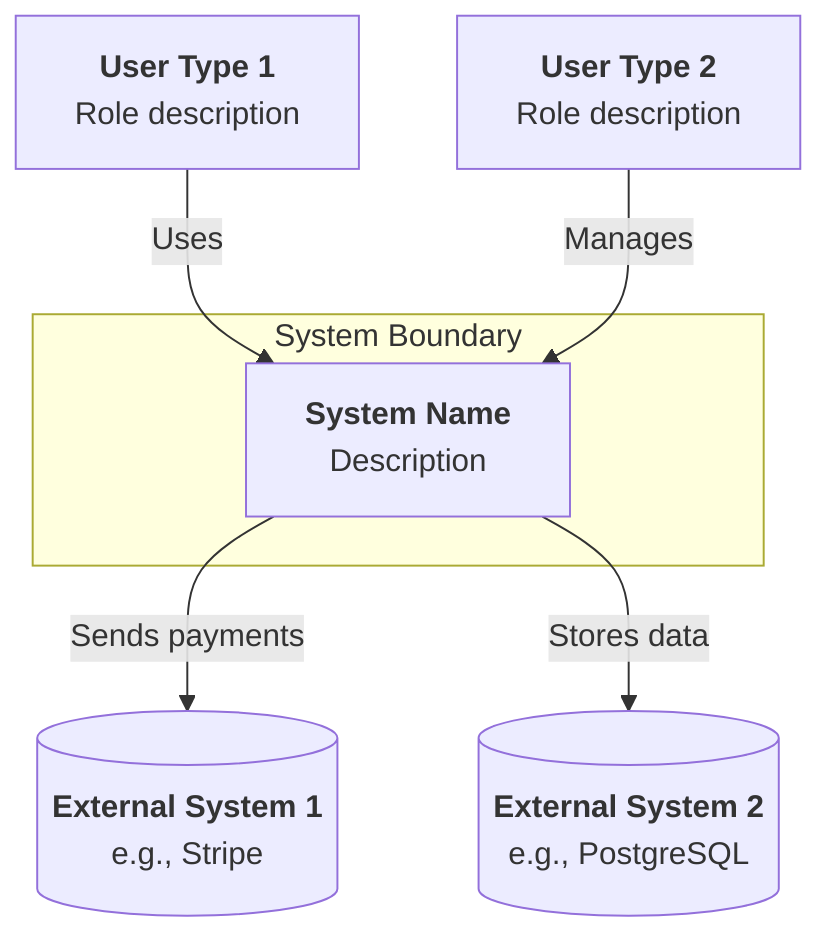
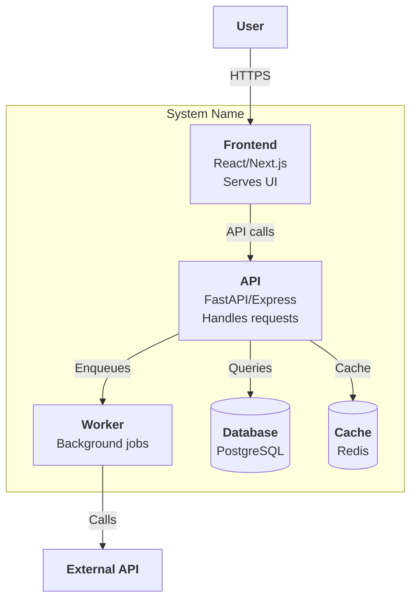
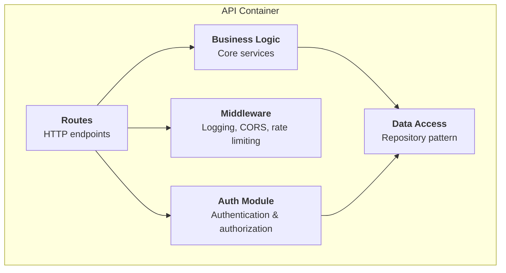
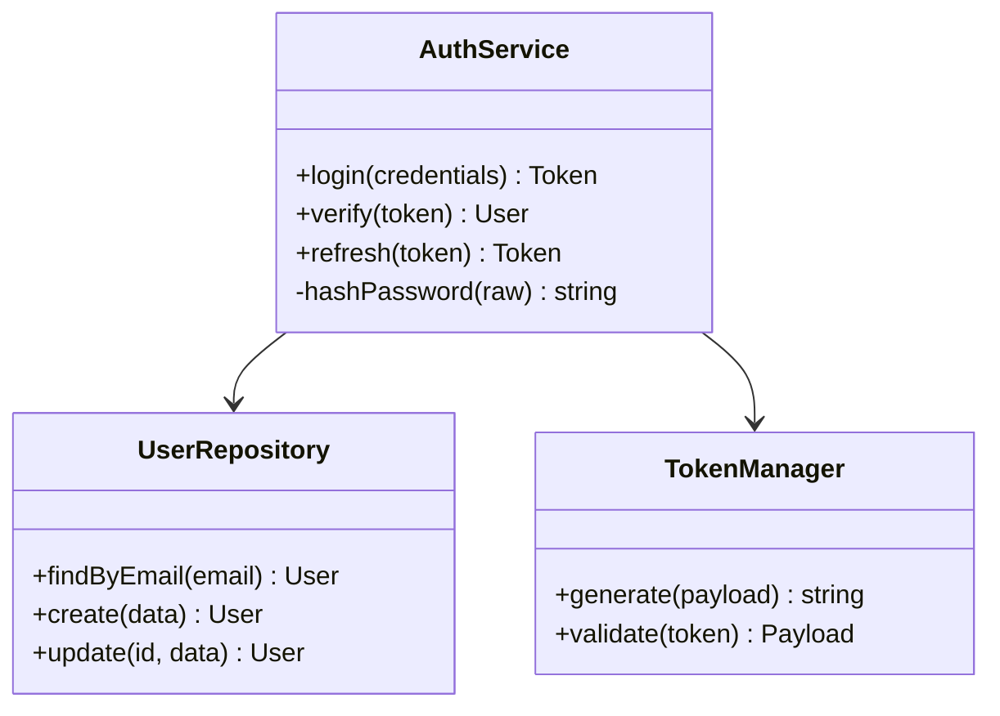

# C4 Architecture Diagrams

Analyze the codebase and generate C4 model diagrams at all four levels. Outputs Mermaid syntax for rendering in docs, PRs, or READMEs.

## Quick Help

**What**: Auto-generate C4 architecture diagrams from code analysis. Four zoom levels: system context → containers → components → code.
**Usage**:
- `/my-c4-architecture context` — Level 1: system context (your system + external actors/systems)
- `/my-c4-architecture container` — Level 2: containers (apps, databases, message queues)
- `/my-c4-architecture component src/api/` — Level 3: components within a container
- `/my-c4-architecture code src/api/auth/` — Level 4: classes/functions within a component
- `/my-c4-architecture all` — generate all 4 levels
**Output**: Mermaid diagram code blocks + written to `docs/architecture/` if docs dir exists.

## C4 Levels

### Level 1: System Context

**What it shows**: Your system as a black box. Who uses it? What external systems does it talk to?

**How to discover**:
1. Read project README, CLAUDE.md, any architecture docs
2. Grep for external API calls, SDK imports, webhook handlers
3. Identify user types from auth/role code
4. Check docker-compose, infra configs for external services

**Output template**:


### Level 2: Container

**What it shows**: The major deployable units — frontend apps, backend APIs, databases, queues, workers.

**How to discover**:
1. Check for monorepo structure (`apps/`, `packages/`, `services/`)
2. Read docker-compose.yml, Dockerfile(s)
3. Check package.json workspaces or similar
4. Identify databases from connection strings/ORM config
5. Check for queue/worker patterns (Bull, Celery, SQS)

**Output template**:


### Level 3: Component

**What it shows**: Major components/modules within a single container.

**How to discover**:
1. Read the target directory structure
2. Identify modules by directory boundaries
3. Trace imports to map dependencies between modules
4. Identify patterns: routes → controllers → services → repositories

**Output template**:


### Level 4: Code

**What it shows**: Classes, functions, and their relationships within a component.

**How to discover**:
1. Read all files in the target directory
2. Map exports, classes, functions
3. Trace call chains and data flow
4. Identify key interfaces/types

**Output template**:


## Step 0: Resolve Project Root

Before any file operations, resolve the git repo root. All project-relative paths (`docs/architecture/`) are relative to this root, NOT `pwd`.

```bash
PROJECT_ROOT=$(git rev-parse --show-toplevel 2>/dev/null || pwd)
```

## Steps

### 1. Determine Level(s)

| Argument | Levels Generated |
|----------|-----------------|
| `context` | Level 1 only |
| `container` | Level 2 only |
| `component [path]` | Level 3 for specified container |
| `code [path]` | Level 4 for specified component |
| `all` | All 4 levels (dispatches agents in parallel for 1-3, code level for main API) |

### 2. Analyze Codebase

For `all` mode, dispatch 3 agents in parallel:
- Agent 1: System context + container discovery (reads configs, docker, READMEs)
- Agent 2: Component mapping for the main backend (reads API source)
- Agent 3: Component mapping for the frontend (reads UI source)

For single-level mode, do the analysis directly.

### 3. Generate Diagrams

- Output Mermaid code blocks in the response
- If `docs/` or `docs/architecture/` exists, also write to files:
  - `docs/architecture/c4-context.md`
  - `docs/architecture/c4-container.md`
  - `docs/architecture/c4-component-<name>.md`
  - `docs/architecture/c4-code-<name>.md`

### 4. Validate

After generating, verify:
- All nodes referenced in edges actually exist in the diagram
- No orphan nodes (everything connects to something)
- Labels are descriptive (not just "Service A")
- External systems are outside the boundary box

## Gotchas

- Mermaid C4 diagrams require the c4 diagram type which not all renderers support — test in GitHub markdown preview
- Large codebases produce diagrams that are too dense to read — limit to top 2 levels unless the user asks for deeper

## Rules

- Diagrams must be valid Mermaid syntax — test by reading it back
- Use descriptive labels: `"<b>Name</b><br/>Technology<br/>Purpose"` not just `"Name"`
- External systems go OUTSIDE the system boundary subgraph
- Max ~15 nodes per diagram — if more, split into sub-diagrams
- Always distinguish between synchronous (solid arrow) and async (dashed arrow) communication
- Don't invent architecture — only diagram what the code actually shows. If uncertain, mark with `[?]`
- Load `~/.claude/agents/specialists/architect.md` identity when dispatching analysis agents for deeper insight
- Level 4 (code) diagrams can use `classDiagram` or `flowchart` — choose based on whether the code is OOP or functional
